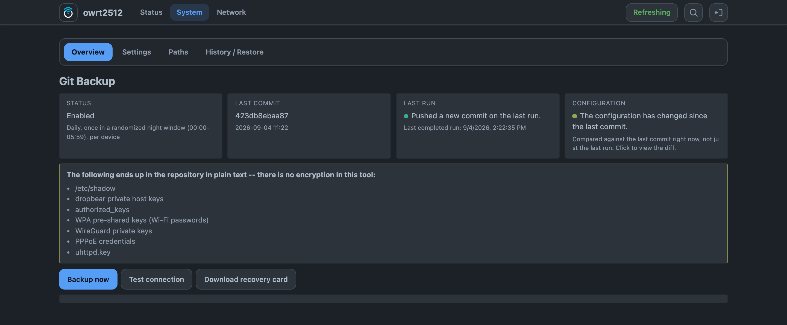
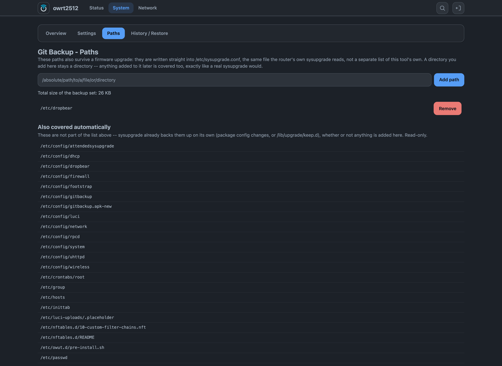
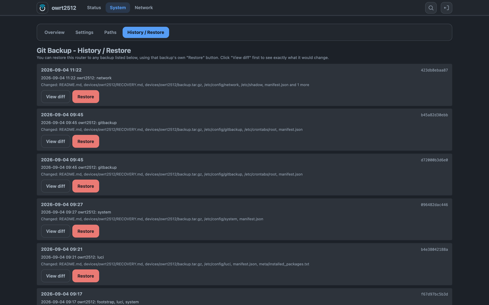

# LUCI-APP-GITBACKUP

[](https://github.com/VizzleTF/luci-app-gitbackup/actions/workflows/ci.yml)

Your router's configuration, committed to a **private** Git repository on a schedule, and put back
onto a bare device with one command. The repository is never cloned and no working copy is ever
written to the router: a run reads the files, builds a tree with git's plumbing, and pushes it.
OpenWrt **25.12** and newer.

Two packages: `gitbackup` — the CLI, the scheduler and the rpcd backend, POSIX shell for busybox
`ash` — and `luci-app-gitbackup`, four tabs of client-side JS on `luci-base` and nothing else.
Plus `bootstrap.sh`, which is not a package: it is the line you paste into a router that has just
been reset.

<picture>
  <source media="(max-width: 767px)" srcset="assets/readme/overview-mobile.png">
  
</picture>

<details>
<summary>Settings, Paths, History / Restore</summary>






</details>

## Install

On OpenWrt 25.12 or newer, subscribe to the feed that carries these packages and install by name:

```sh
wget -qO- https://repo.owfeed.org/subscribe.sh | sh
apk add gitbackup luci-app-gitbackup
```

`luci-i18n-gitbackup-ru` installs itself alongside on a router that already reads Russian.

Installing the feed's key trusts that feed for every package name, so read `subscribe.sh` before
running it as root — it is generated from the feed's own layout and cannot document a URL the feed
does not serve. What proves *these* packages were built here is a second signature, made with this
repository's own key inside each `.apk`; the feed pins its public half as
[`keys/luci-app-gitbackup.pub.pem`](https://github.com/owfeed/owfeed-packages/tree/main/keys).

Then open **System → Git Backup**.

## Setting it up

You need a **private** repository before you start. Read [Nothing here is encrypted](#nothing-here-is-encrypted) first — that is not a formality.

1. **Settings** → repository URL (`git@host:owner/repo.git` or `https://host/owner/repo.git`) and
   an authentication method.
   - **SSH deploy key** — click *Generate deploy key*, then *Open the repository's deploy-key
     page*, which goes straight to the right page on GitHub, GitLab, Gitea/Forgejo or Codeberg.
     **Tick "Allow write access"**: without it the key can read the repository and every push
     fails silently.
   - **API token** — paste a token scoped to this one repository.
2. **Test connection.** This is also where an unknown SSH host key is shown with its fingerprint
   and accepted once, from the browser, with no ssh session needed.
3. Pick a **schedule**. The hourly/daily/weekly presets deliberately do not fire at the same
   wall-clock time on every device: the minute, and for daily and weekly the hour, are derived
   from the router's own identifier, so a fleet on one preset does not wake up in the same second.
4. **Overview → Backup now**, and watch the log.

## What it does

- **Never clones.** A run fetches only its own branch's tip metadata (`--depth=1
  --filter=blob:none`), hashes the files it collected, writes a tree and pushes a commit built
  with `git commit-tree`. Nothing is checked out, and nothing is written to flash.
- **One branch per device.** `device/<id>`, with the identifier taken from the hostname, the
  model plus MAC, or whatever you type. Twenty routers share one repository and never collide.
- **Records what git does not.** Git stores content and an executable bit. A `manifest.json`
  beside the files carries the type, mode, owner, group and sha256 of every path, so a restore
  puts them back as they were rather than merely with the right bytes.
- **Restores to any backup, from the browser.** Every row on **History / Restore** has its own
  Restore button, with a diff first, a double confirmation, the list of files that will be
  overwritten, and a warning when the backup came from a different board.
- **Refuses to push to a public repository.** Before every push the repository's visibility is
  checked anonymously against the provider's API — no token needed for the check itself. A
  repository that answers "public" is refused outright, not warned about.
- **Widens `sysupgrade` while it is at it.** A path added under **Paths** is written into
  `/etc/sysupgrade.conf`, the file the router's own `sysupgrade` reads. One list, both jobs.
- **Puts the recovery instructions where you will look for them.** Every device branch carries a
  `README.md` with the exact command to bring that router back — GitHub renders it when you open
  the branch on a phone, which is the situation this tool exists for.

## Recovering a router that has been reset

One line, and the router pulls its own configuration back:

```sh
wget -qO- https://raw.githubusercontent.com/VizzleTF/luci-app-gitbackup/main/bootstrap.sh \
  | sh -s -- --repo https://github.com/you/routers --device r1 --token <token>
```

It installs the package with a real signature check (never `--allow-untrusted`), writes the one
credential you gave it, restores the newest backup for that device, and tells you what it did.
`--commit` picks an older one, `--dry-run` performs none of it and prints the plan.

Two other routes exist and are described in **[docs/RESTORE.md](docs/RESTORE.md)** — including the
one that needs no network at all: download `backup.tar.gz` from the repository's web UI and feed
it to LuCI's own restore.

## Nothing here is encrypted

Everything this tool backs up reaches the repository as plain text, exactly as it sits on the
router — except the specific UCI options you tell it to scrub. Depending on your configuration
that includes `/etc/shadow`, dropbear's private host keys, `authorized_keys`, WPA pre-shared
keys, WireGuard private keys, PPPoE credentials and `uhttpd.key`.

**A private repository is the only thing between that list and the internet.** Two consequences
worth stating plainly:

- Compromise the Git account and you compromise every router in it, at once.
- Compromise one router and the attacker holds a repository-wide deploy key. Nothing in git's
  access model scopes a key to "this device's branch only".
- **Switching the repository from private to public leaks the entire history**, including every
  value ever committed and rotated since. Forks and public-repository mirrors keep their copies.
  Treat that toggle as a one-way door.

Use an account dedicated to infrastructure, turn on 2FA, and give each device its own deploy key
so one can be revoked without touching the rest.

## Measured, not claimed

Numbers, not adjectives. Every one of these was taken from a running system.

**It is not a small package, and the reason is `git`.** Measured with `du -sx /` on a stock
`openwrt/rootfs:x86_64-25.12.4` image, one package at a time:

| state | flash used | packages |
|---|---:|---:|
| stock 25.12.4 | 14.7 MiB | 136 |
| + `gitbackup` | 42.1 MiB | 146 |
| + `luci-app-gitbackup` | 42.3 MiB | 147 |

Our own two packages are **282 KiB** and **182 KiB** (`apk info -s`). Everything else in that
27.6 MiB is a real git client, installed once:

| dependency | installed | why it is not optional |
|---|---:|---|
| `git` | 11 MiB | the actual git, not a reimplementation |
| `libopenssl3` | 6.3 MiB | pulled in by `git` |
| `git-http` | 5.0 MiB | without it `git fetch https://` fails with `remote-https is not a git command` |
| `openssh-client` | 898 KiB | busybox's `dbclient` cannot read OpenSSH keys, ignores `UserKnownHostsFile`, and git silently drops `-o StrictHostKeyChecking=yes` when it falls back to it — measured with `GIT_TRACE=1`, see [ADR 0006](docs/adr/0006-openssh-client-over-dbclient.md) |
| `libcurl4` + `libnghttp2` | 606 KiB | required by `git-http` |
| `openssh-keygen` | 352 KiB | generates the deploy key |
| `ca-bundle` | 177 KiB | https to the provider |
| `coreutils-stat` | 100 KiB | the base image ships no `stat` at all, and the manifest records modes and ownership |
| `jsonfilter` | 24 KiB | parsing the manifest in shell |

**A device with 16 MB of flash cannot run this**, and there is no partial install that fits.
Treat 128 MB as the practical floor. [docs/COMPARISON.md](docs/COMPARISON.md) covers what to use
instead.

**A backup writes nothing to flash.** Every file under `/etc`, `/usr`, `/lib`, `/www` and `/root`
was hashed before and after a `gitbackup run` on a configured router: **0 of 1056 files changed.**
The collected copy lives in `/tmp`, and the free space needed for it is checked before the run
starts.

**What CI holds this to:** 734 shell unit tests, 55 for `bootstrap.sh`, 16 for the History view,
and 41 cron expressions checked against the *same fixture file* by both the shell validator and
the JavaScript one, so the two cannot drift apart. Plus `shellcheck` over a file list derived from
the tree rather than typed by hand, `eslint` with `openwrt/luci`'s own config, a `msgcmp` gate on
the translations, and a round trip through the buildbot's own `jsmin.c` that compares the token
stream before and after — because that minifier silently eats the rest of a file after `return
/re/` and exits 0 while doing it.


## Documentation

- **[docs/RESTORE.md](docs/RESTORE.md)** — the three ways to get a router's configuration back,
  in the order you should reach for them.
- **[docs/COMPARISON.md](docs/COMPARISON.md)** — an honest comparison with restic, borg and
  etckeeper, including who this tool is the wrong choice for.
- **[docs/adr/](docs/adr/)** — why the load-bearing decisions are what they are: pushing without
  a clone, the manifest, the visibility gate, `openssh-client` over dbclient.
