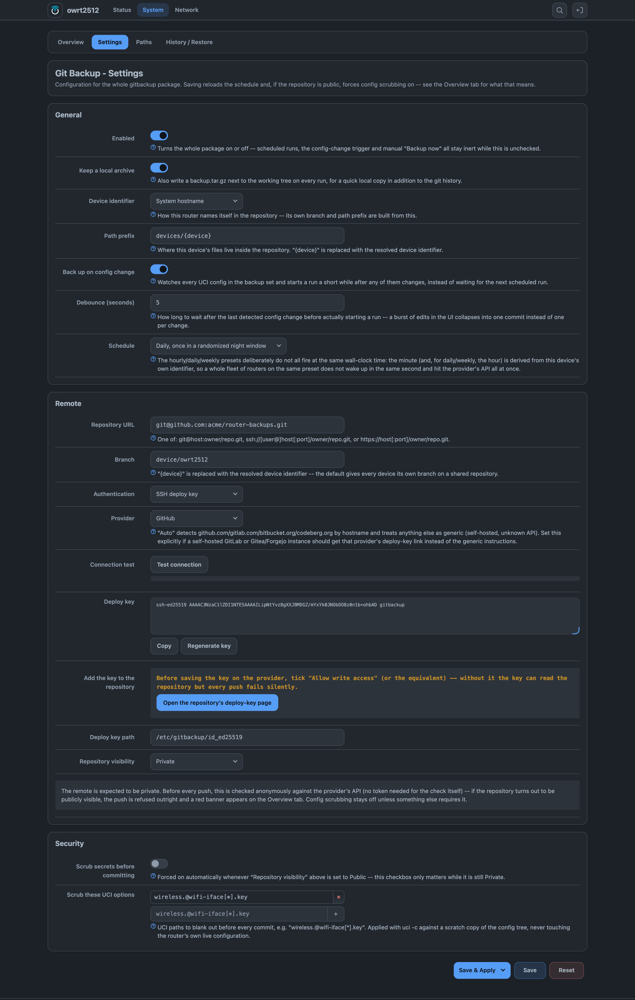

# luci-app-gitbackup

[](https://github.com/VizzleTF/luci-app-gitbackup/actions/workflows/ci.yml)

Backs up an OpenWrt router's configuration into a private Git repository on a schedule, and
restores it onto a reset router with one command. The repository is never cloned: a run reads the
files, builds a tree with Git plumbing and pushes it, writing nothing to flash.

For OpenWrt 25.12 and newer. Two packages — `gitbackup` (CLI, scheduler, rpcd backend) and
`luci-app-gitbackup` (four tabs in LuCI) — plus `bootstrap.sh`, the recovery one-liner.

<picture>
  <source media="(max-width: 767px)" srcset="assets/readme/overview-mobile.png">
  
</picture>

<details>
<summary>Settings, Paths, History / Restore</summary>




</details>

## Before you install

**This needs about 28 MiB of free flash**, because it needs a real Git client. A 16 MB device
cannot run it and there is no smaller subset that fits. Full breakdown:
[docs/footprint.md](docs/footprint.md); lighter alternatives:
[docs/COMPARISON.md](docs/COMPARISON.md).

**Nothing is encrypted.** Everything reaches the repository as plain text — see
[Security](#security) before pointing this at a repository.

## Install

```sh
wget -qO- https://repo.owfeed.org/subscribe.sh | sh
apk add gitbackup luci-app-gitbackup
```

`subscribe.sh` runs as root and installs a signing key that makes the router trust that feed for
every package name, so read it first. On a router that already reads Russian,
`luci-i18n-gitbackup-ru` is pulled in automatically.

The packages carry a second signature, made with this repository's own key, inside each `.apk`.
The feed pins its public half as `keys/luci-app-gitbackup.pub.pem`.

## Set it up

You need a private Git repository first.

1. Open **System → Git Backup → Settings**. Enter the repository URL —
   `git@host:owner/repo.git` or `https://host/owner/repo.git` — and pick an authentication
   method.
   - **SSH deploy key:** click *Generate deploy key*, then *Open the repository's deploy-key
     page*. Tick **Allow write access** there. Without it every push fails silently.
   - **API token:** paste a token scoped to this repository alone.
2. Click **Test connection**. An unknown SSH host key is shown here with its fingerprint and
   accepted once, from the browser.
3. Pick a schedule. The hourly, daily and weekly presets derive their minute — and for daily and
   weekly, their hour — from the router's own identifier, so a fleet on one preset does not all
   wake at the same second.
4. Go to **Overview** and click **Backup now**.

A successful run ends with `pushed <hash> to device/<id>` in the log, and the Last commit card
fills in.

## Restore a router that was reset

```sh
wget -qO- https://raw.githubusercontent.com/VizzleTF/luci-app-gitbackup/main/bootstrap.sh \
  | sh -s -- --repo https://github.com/you/routers --device r1 --token <token>
```

This installs the package with a signature check, writes the credential you passed, and restores
that device's newest backup. Add `--commit <hash>` for an older one, or `--dry-run` to print the
plan without doing any of it.

Two other routes, including one that needs no network:
[docs/RESTORE.md](docs/RESTORE.md).

## What it does

- **Pushes without cloning.** A run fetches its branch tip with `--depth=1 --filter=blob:none`,
  hashes the collected files, writes a tree and pushes a commit built by `git commit-tree`.
- **Gives each device its own branch.** `device/<id>`, where the identifier comes from the
  hostname, the model plus MAC, or a name you type.
- **Records what Git does not.** A `manifest.json` beside the files stores type, mode, owner,
  group and sha256 for every path, so a restore puts them back as they were.
- **Restores any backup from the browser.** Every row on History / Restore has its own Restore
  button, with a diff, a double confirmation, the list of files to be overwritten, and a warning
  when the backup came from a different board.
- **Refuses to push to a public repository.** Visibility is checked anonymously against the
  provider's API before every push, and a public repository is refused rather than warned about.
- **Widens `sysupgrade` too.** Paths added under the Paths tab go into `/etc/sysupgrade.conf`,
  the file the router's own `sysupgrade` reads.
- **Commits recovery instructions.** Each device branch carries a `README.md` with the exact
  command to bring that router back, which GitHub renders when you open the branch.

## Security

Everything backed up reaches the repository as plain text, exactly as it sits on the router,
except the UCI options you list for scrubbing. Depending on the configuration that includes
`/etc/shadow`, dropbear's private host keys, `authorized_keys`, WPA pre-shared keys, WireGuard
private keys, PPPoE credentials and `uhttpd.key`.

A private repository is the only thing between that list and the internet. Three consequences:

- Compromising the Git account compromises every router in it at once.
- Compromising one router yields a repository-wide deploy key. Git cannot scope a key to a single
  branch.
- Making the repository public leaks the whole history, including values rotated long ago. Forks
  and mirrors keep their copies. Treat that switch as one-way.

Use an account dedicated to infrastructure, turn on 2FA, and give each device its own deploy key.

## Verified behaviour

| claim | how it was checked |
|---|---|
| A backup writes nothing to flash | 1056 files hashed before and after a run; 0 changed |
| The shell and JavaScript cron validators agree | both run against `tests/fixtures/cron.tsv`, 41 cases, in CI |
| The UI knows when an operation ended | the shell messages and the three JavaScript regexes are checked against one fixture, `tests/fixtures/terminal-markers.tsv`, 39 cases including near misses |
| The minifier does not corrupt the views | the token stream of each view is compared before and after the buildbot's own `jsmin.c` |
| The packages install and work on a real router | CI installs the built `.apk` on an OpenWrt 25.12.4 container and drives it |
| The styles work under any LuCI theme | the shipped CSS of all six view files, checked against the footstrap devkit's eleven rules: nothing flagged |

Test suites: 789 shell unit tests, 55 for `bootstrap.sh`, 16 for the History view.

## Documentation

- [docs/RESTORE.md](docs/RESTORE.md) — the three ways to get a configuration back.
- [docs/footprint.md](docs/footprint.md) — disk footprint and where it goes.
- [docs/COMPARISON.md](docs/COMPARISON.md) — restic, borg, etckeeper, and who should use those.
- [docs/adr/](docs/adr/) — why the load-bearing decisions are what they are.
